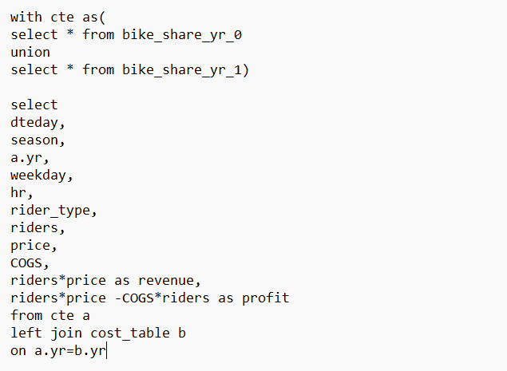
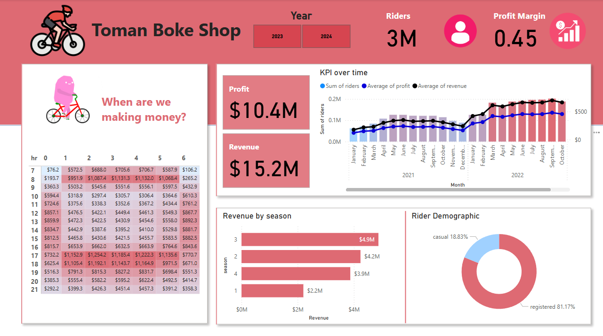
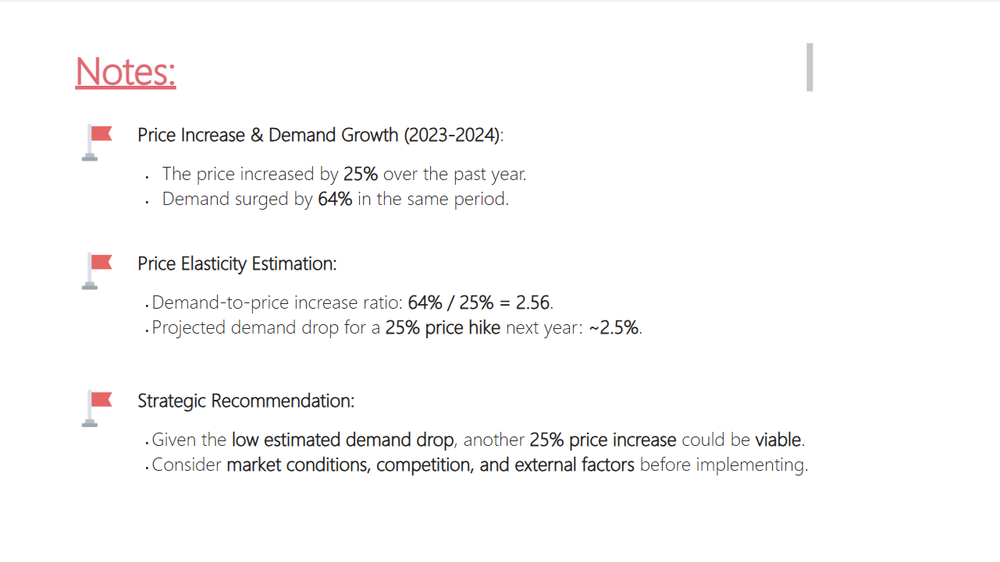

# 🚲 End-to-End Bike Data Analysis | SSMS ➡️ SQL ➡️ Power BI

## 📊 Overview
This Power BI report provides insights into bike usage patterns, trends, and key performance indicators. It includes visualizations and data-driven analysis to help understand factors affecting bike rentals.

## ✨ Features
- 📌 **Interactive Dashboards**: Explore key metrics with dynamic filters and slicers.
- 📈 **Custom Measures**: DAX-powered calculations for in-depth insights.
- ⚡ **Performance Optimization**: Best practices applied for smooth performance.

## 🏗 Data Model
The report utilizes:
- 📄 **Tables**: Bike rentals, customer details, time series data.
- 🧮 **DAX Measures**: Custom metrics for aggregation and trend analysis.

## 🗄 Data Source  
The data for this report was fetched from **SQL Server Management Studio (SSMS)** using a SQL query. The extracted data was then imported into Power BI for analysis.

## 🖼 Screenshots  
### 1️⃣ Bike Data Report  

### 2️⃣ Notes

## 🔎 Key Findings
- 📈 **Price Increase & Demand Growth (2023-2024):**
  - The price increased by **25%** over the past year.
  - Demand surged by **64%** in the same period.

- 📊 **Price Elasticity Estimation:**
  - Demand-to-price increase ratio: **64% / 25% = 2.56**.
  - Projected demand drop for a **25% price hike next year**: **~2.5%**.

- 🎯 **Strategic Recommendation:**
  - Given the **low estimated demand drop**, another **25% price increase** could be viable.
  - Consider **market conditions, competition, and external factors** before implementing.

## 🛠 Requirements
- 🖥 **Power BI Desktop** (latest version)

## 🚀 How to Use
1. 📂 Open `bike_data.pbix` in Power BI Desktop.
2. 🖱 Navigate through the report pages using the tabs.
3. 🎛 Apply filters and slicers to explore different insights.

## 👤 Author
Mohammed Haneef  
